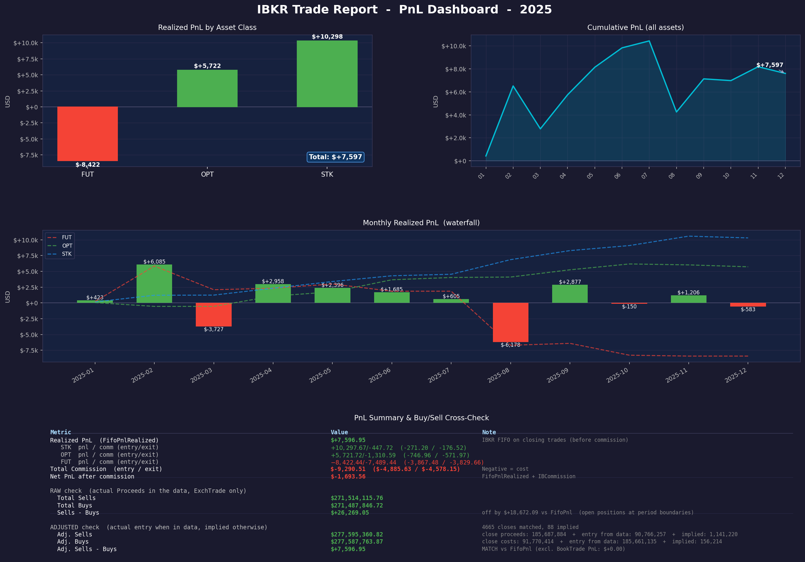

# IBKR PnL Report Generator

Generates a graphical PnL dashboard from an Interactive Brokers trade export CSV.



---

## Quick Start (for beginners)

### 1. Install Python

Download Python from https://www.python.org/downloads/ and install it.
Make sure to check **"Add Python to PATH"** during installation.

### 2. Install dependencies

Open a terminal (Command Prompt or PowerShell on Windows, Terminal on Mac/Linux),
navigate to the folder containing the script, and run:

```
pip install -r requirements.txt
```

### 3. Export your trades from IBKR

In Interactive Brokers, go to **Reports -> Flex Queries -> Custom Flex Queries**
and create a new **Trades** query. Include at least these columns:

| Column | Required |
|---|---|
| `ClientAccountID` | Yes |
| `TradeDate` | Yes |
| `TransactionType` | Yes |
| `AssetClass` | Yes |
| `Buy/Sell` | Yes |
| `Proceeds` | Yes |
| `FifoPnlRealized` | Yes |
| `Open/CloseIndicator` | Yes |
| `IBCommission` | Yes |
| `Symbol` | Yes |
| `Quantity` | Yes |
| `ClosePrice` | Yes |
| `Multiplier` | Yes |

Export settings: **CSV format**, date format **yyyy-MM-dd**, include header row.

### 4. Run the script

Place the downloaded CSV file in the same folder as `pnl_report.py`, then run:

```
python pnl_report.py
```

If there are multiple CSV files, the script will ask which one to use.
If the CSV contains multiple years, you can pick which year to report on
(or pass it as an argument: `python pnl_report.py 2025`).

The report is saved as `pnl_report_<year>.png` in the same folder.

---

## How the cross-check works

The report shows two independent PnL calculations and verifies they match.

**FifoPnlRealized** is IBKR's own number on every closing trade. This is always
correct, even for positions opened in a prior year.

**Adjusted Sells - Buys** is computed from actual cash flows:
- For each closing trade, the close value is known (Proceeds for exchange trades,
  or ClosePrice x Multiplier x Qty for assignments/expirations)
- The entry price is taken from the matching opening trade in the data (FIFO order)
- If the opening trade is not in the CSV (opened before the export period),
  the entry is derived: `implied_entry = close_value - FifoPnlRealized`
- If the CSV covers multiple years, prior-year opening trades are used to match
  entries, reducing the number of implied values needed

When both numbers match, the data is consistent.

---

## Supported asset classes

The script works with any `AssetClass` value that IBKR exports. It groups PnL
and commissions per asset class automatically. Commonly seen values:

| AssetClass | What it is | How it works |
|---|---|---|
| `STK` | Stocks, ETFs, ADRs | BUY/SELL with Proceeds. Straightforward. |
| `OPT` | Options (equity, index, weekly) | Uses `Multiplier` (typically 100) to compute settlement value for BookTrades (assignments, exercises, expirations). Expired worthless = close value $0. |
| `FUT` | Futures (ES, NQ, MES, MNQ, etc.) | Same as stocks — BUY/SELL with Proceeds. Multiplier is embedded in the contract price by IBKR. |
| `CASH` | Forex conversions | Tracked for completeness. Usually has $0 PnL and small commission. |

### How each trade type is handled

| TransactionType | What it is | Close value used |
|---|---|---|
| `ExchTrade` | Actual exchange execution | `Proceeds` (real cash) |
| `BookTrade` | Internal settlement (assignment, exercise, expiry) | `ClosePrice x Multiplier x Quantity` |
| `TradeCancel` | Cancelled trade | Excluded from all calculations |

### Options specifics

Options have extra complexity because positions can close in three ways:

1. **Sold/bought back on exchange** (`ExchTrade`, `Open/CloseIndicator=C`) —
   normal trade, Proceeds reflects actual price.
2. **Assigned or exercised** (`BookTrade`, `Notes/Codes=A` or `Ex`) —
   IBKR settles at intrinsic value. `ClosePrice` = intrinsic, `Proceeds=0`.
   The script uses `ClosePrice x Multiplier x Qty` as the true close value.
3. **Expired worthless** (`BookTrade`, `Notes/Codes=Ep`) —
   `ClosePrice=0`, so close value = $0. The full entry cost becomes the loss.

All three are handled automatically. The `Multiplier` column (100 for standard
options) is required to compute settlement values correctly.
